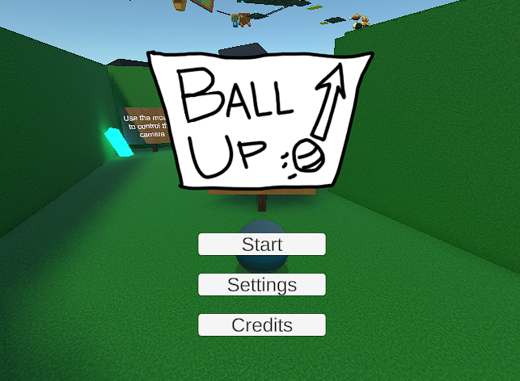

# Hi, I'm Zihao, Welcome to My GitHub Homepage!

You may be interested in **BallUp**, a Unity game created by Kyle and me for our CS 134 course project.

You can play it online here. It may be a little challenging, but I hope you have fun!

https://kylejamessjsu.itch.io/ballup

## Other Course Projects

### CS 151 — Object-Oriented Design  
**Fall 2025**

#### Student Academic and Professional Development Management System

A student status management system built with **JavaFX** and compiled using **Zulu 25**.

**Responsibilities:**  
Code implementation and testing, edge-case testing, bug fixing, code cleanup, and packaging.

**Repo:**  
https://github.com/Sujan30/Team-18-CS151-Term-Project-03-Code-Version-0.2-

---

### CS 157A — Introduction to Database Management Systems  
**Fall 2025**

#### Campus Equipment Lending Hub

A full-stack campus equipment lending and management platform for students and staff, built with **Node.js**, **React**, and **MySQL**.

**Repo:**  
(Private repository due to course materials.)

---

### CMPE 172 — Enterprise Software Platforms  
**Fall 2025**

#### Hello Server

A **Java** web server and Java client built with **Spring Boot**, using a REST API architecture.

**Repo:**  
(Private repository due to course materials.)

---

### CS 166 — Information Security  
**Fall 2025**

#### Elliptic Curve Cryptography (ECC) Implementation & Performance Analysis

A **Python** project designed to test and compare the performance of **ECC**, **ECDSA**, and **RSA** encryption algorithms on a local machine.

The project also generates charts to visualize and analyze the performance differences between the algorithms.

**Responsibilities:**  
Code testing and performance analysis of the differences between the algorithms.

**Repo:**  
(Private repository due to course materials.)

---

### CS 134 — Computer Game Design and Programming  
**Spring 2025**

#### BallUp

A Unity game project written in **C#**.

**Responsibilities:**  
Asset management, level design, and level implementation.

**Repo:**  
https://github.com/KyleJamesSJSU/BallUp

---

### CMPE 195 — Senior Design Project  
**Fall 2026 — In Progress**

#### FitFuel

An Android application built with **Kotlin** and **Android Studio** for creating day-to-day diet plans based on a user’s calorie trajectory.

**Repo:**  
https://github.com/SJSU-CMPE-195/group-project-group20
